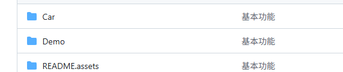
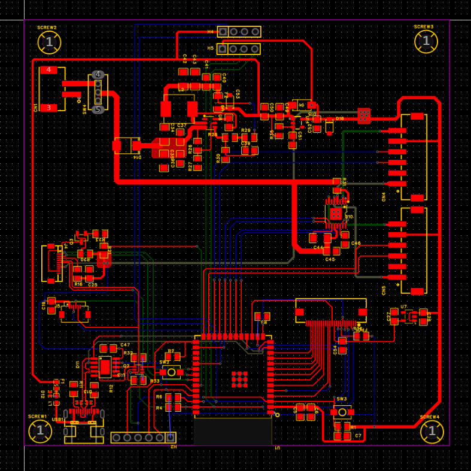
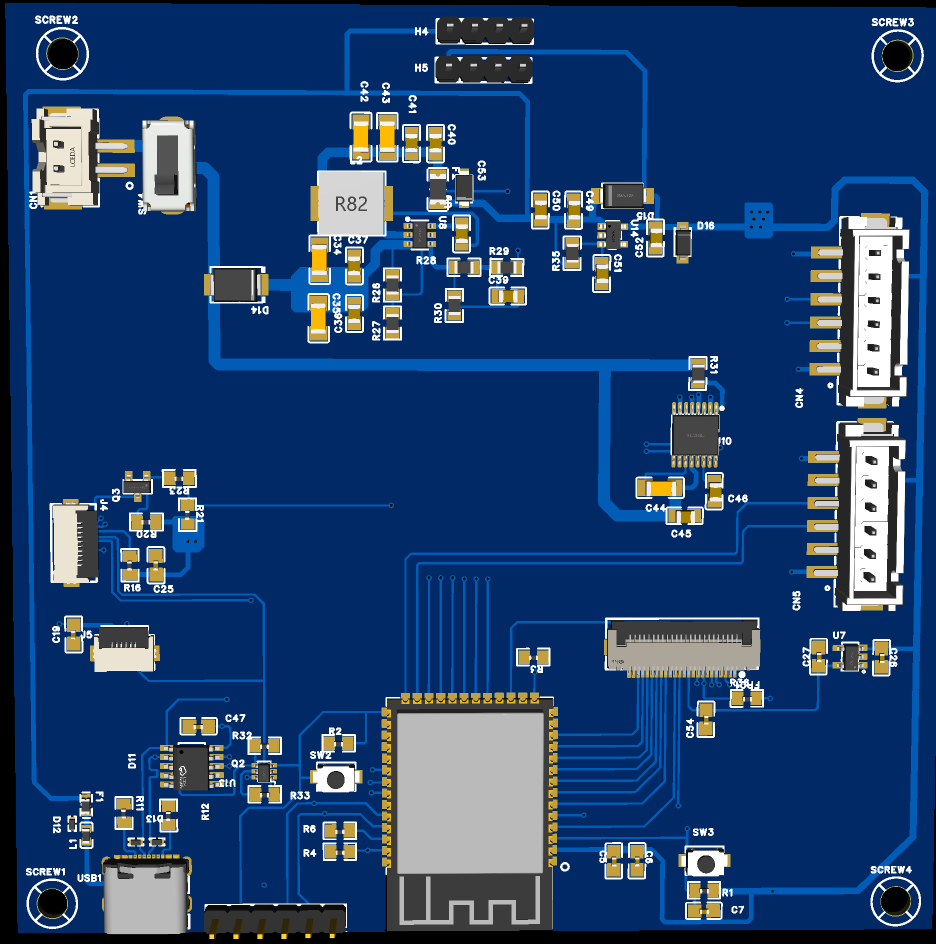
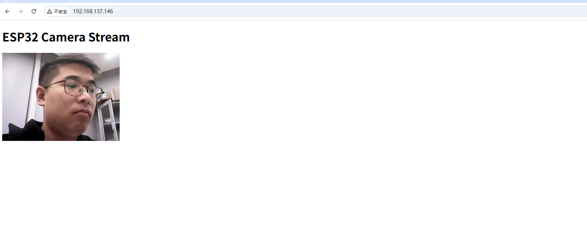
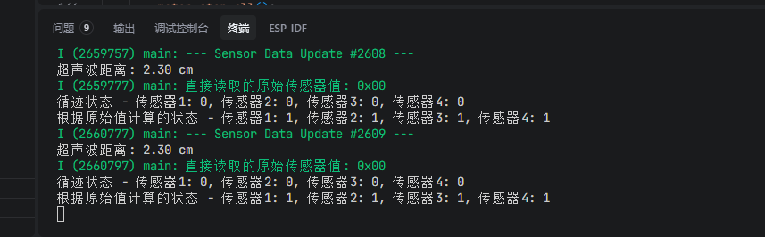

## 七牛云议 题目三  嵌入式小车

**软硬件均由个人独立完成**

**Demo视频放在根文件下了**



## 硬件设计

物料准备

- 电池 三节18650电池12V
- DCDC芯片、LDO
- 各个传感器模块
- ESP3 S3

### 原理图

#### 电源原理图

12V 转 5V  5V 转3.3V


#### MCU和外设


#### 外设


### PCB





### 小车实物照片


## 软件设计

### 程序架构

1. 硬件初始化
   ├── I2C总线初始化
   ├── 电机驱动初始化  
   ├── 超声波传感器初始化
   └── 摄像头初始化

2. 任务创建
   ├── 超声波测距任务 (后台运行)
   ├── 循迹控制任务 (实时控制电机)
   ├── 传感器数据打印任务 (调试用)
   └── WiFi/HTTP服务器任务

3. 系统服务
   ├── NVS Flash初始化
   ├── WiFi连接
   └── HTTP服务器启动

### 摄像头视频流传输

MJPEG流处理核心函数

```c
static esp_err_t mjpeg_stream_handler(httpd_req_t *req)
{
    // 设置HTTP响应类型为multipart流
    httpd_resp_set_type(req, _STREAM_CONTENT_TYPE);
    
    while (true) {
        // 1. 从摄像头获取帧缓冲区
        camera_fb_t *fb = esp_camera_fb_get();
        
        // 2. 将原始图像数据转换为JPEG格式
        if (!fmt2jpg(fb->buf, fb->len, fb->width, fb->height, 
                     PIXFORMAT_RGB565, 80, &jpeg_buf, &jpeg_len)) {
            // 转换失败处理
        }
        
        // 3. 发送multipart边界和HTTP头
        httpd_resp_send_chunk(req, _STREAM_BOUNDARY, strlen(_STREAM_BOUNDARY));
        httpd_resp_send_chunk(req, part_buf, strlen(part_buf));
        
        // 4. 发送JPEG图像数据
        httpd_resp_send_chunk(req, (const char*)jpeg_buf, jpeg_len);
        
        // 5. 控制帧率 (~20fps)
        vTaskDelay(50 / portTICK_PERIOD_MS);
    }
}
```

HTTP协议格式详解

```
// 边界标识符
#define PART_BOUNDARY "123456789000000000000987654321"

// Content-Type头
static const char* _STREAM_CONTENT_TYPE = 
    "multipart/x-mixed-replace;boundary=" PART_BOUNDARY;

// 分段边界
static const char* _STREAM_BOUNDARY = "\r\n--" PART_BOUNDARY "\r\n";

// 每帧的HTTP头
static const char* _STREAM_PART = 
    "Content-Type: image/jpeg\r\nContent-Length: %u\r\n\r\n";
```



### 超声波测距和循迹

超声波测量代码

```C
esp_err_t ultrasonic_sensor_measure(float *distance)
{
    esp_err_t ret = ESP_OK;
    int64_t start_time = 0;
    int64_t end_time = 0;
    int64_t duration = 0;
    uint32_t timeout_count = 0;
    
    if (distance == NULL) {
        ESP_LOGE(TAG, "Distance pointer is NULL");
        return ESP_ERR_INVALID_ARG;
    }
    
    // 初始化开始时间用于超时检测
    start_time = esp_timer_get_time();
    
    // 触发超声波传感器
    ret = ultrasonic_sensor_trigger();
    if (ret != ESP_OK) {
        ESP_LOGE(TAG, "Failed to trigger ultrasonic sensor: %s", esp_err_to_name(ret));
        return ret;
    }
    
    // 等待ECHO引脚变为高电平
    while (gpio_get_level(ULTRASONIC_ECHO_PIN) == 0) {
        if (esp_timer_get_time() - start_time > ULTRASONIC_TIMEOUT_MS * 1000) {  // 微秒级超时检测
            ESP_LOGE(TAG, "Timeout waiting for ECHO to go high");
            *distance = -1.0f;
            return ESP_FAIL;
        }
        // 增加延时时间，减少CPU占用
        esp_rom_delay_us(10);
    }
    
    // 记录ECHO引脚变为高电平的时间
    int64_t high_start_time = esp_timer_get_time();
    
    // 等待ECHO引脚变为低电平
    while (gpio_get_level(ULTRASONIC_ECHO_PIN) == 1) {
        if (esp_timer_get_time() - start_time > ULTRASONIC_TIMEOUT_MS * 1000) {  // 微秒级超时检测
            ESP_LOGE(TAG, "Timeout waiting for ECHO to go low");
            *distance = -1.0f;
            return ESP_FAIL;
        }
        // 增加延时时间，减少CPU占用
        esp_rom_delay_us(10);
    }
    
    // 记录ECHO引脚变为低电平的时间
    end_time = esp_timer_get_time();
    
    // 计算超声波往返时间(微秒)
    duration = end_time - high_start_time;
    
    // 计算距离(cm)：距离 = (时间 * 声速) / 2，声速343m/s = 0.0343cm/us
    *distance = (duration * 0.0343f) / 2.0f;
    
    // 检查距离是否在有效范围内
    if (*distance < 0 || *distance > ULTRASONIC_MAX_DISTANCE) {
        ESP_LOGE(TAG, "Measured distance out of range: %.2f cm", *distance);
        *distance = -1.0f;
        return ESP_FAIL;
    }
    
    ESP_LOGD(TAG, "Measured distance: %.2f cm", *distance);
    
    return ESP_OK;
}
```

## 循迹

```c
/ ===================== PD误差计算 =====================
float calc_error_pd(uint8_t sensor_value){
    float weights[4]={-0.8,-1.0,1.0,0.8};
    bool line_detected=false;
    float sum=0.0,count=0.0;

    for(int i=0;i<4;i++){
        g_line_follower.sensor_state[i] = ((sensor_value>>i)&0x01)?1:0;
        if(g_line_follower.sensor_state[i]==0){
            sum+=weights[i];
            count++;
            line_detected=true;
        }
    }

    float current_error=0.0;
    if(line_detected){
        current_error=sum/count;
        lost_line_counter=0;
    }else{
        lost_line_counter++;
        current_error = last_direction * 0.6;
    }

    if(fabs(current_error)<DEAD_ZONE) current_error=0.0;
    return current_error;
}

// ===================== 循迹处理 =====================
static void line_follower_process(uint8_t sensor_value){
    // 失线检测
    bool line_detected=false;
    for(int i=0;i<4;i++){
        if(((sensor_value>>i)&0x01)==0){
            line_detected=true;
            break;
        }
    }

    if(!line_detected){
        motor_stop_all(); // 停止
        int scan_dir = (last_direction>=0)?1:-1;
        while(1){
            // 缓慢原地旋转扫描
            if(scan_dir>0)
                motor_control_both(MOTOR_FORWARD, BASE_SPEED/2, MOTOR_BACKWARD, BASE_SPEED/2);
            else
                motor_control_both(MOTOR_BACKWARD, BASE_SPEED/2, MOTOR_FORWARD, BASE_SPEED/2);

            uint8_t new_val = read_line_follow();
            g_line_follower.sensor_state[0] = ((new_val>>0)&0x01)?1:0;
            g_line_follower.sensor_state[1] = ((new_val>>1)&0x01)?1:0;
            g_line_follower.sensor_state[2] = ((new_val>>2)&0x01)?1:0;
            g_line_follower.sensor_state[3] = ((new_val>>3)&0x01)?1:0;

            // 中间传感器检测到线
            if(g_line_follower.sensor_state[1]==0 || g_line_follower.sensor_state[2]==0){
                motor_stop_all();
                break;
            }

            vTaskDelay(5/portTICK_PERIOD_MS);
        }
    }
```



## 总结

由于是一个人搞得所以比较匆，只完成了基础部分+视频传输

由于硬件画板子花费了两天 送到嘉立创打板子又花了三天  ，所以只有两三天的时间来搞。还有一些硬件上的缺陷：当时忘了加几个按键，导致调pid参数特别费事），有空应该把esp32的空中升级搞一下，下次烧录程序就不这么费事了。板子上画了 摄像头接口但是买的摄像头线顺序不对，但是这一部分功能也算实现了（我有一个开发板带有设摄像头）。

## 完成情况说明

- [x] 硬件连接与初始化

- [x] 超声避障功能

- [x] 颜色寻路功能 

- [x] WiFi 实时图像传输

  另外两个多传感器和视觉辅助没有搞 （时间来不及）

  

  

  

  

  

   